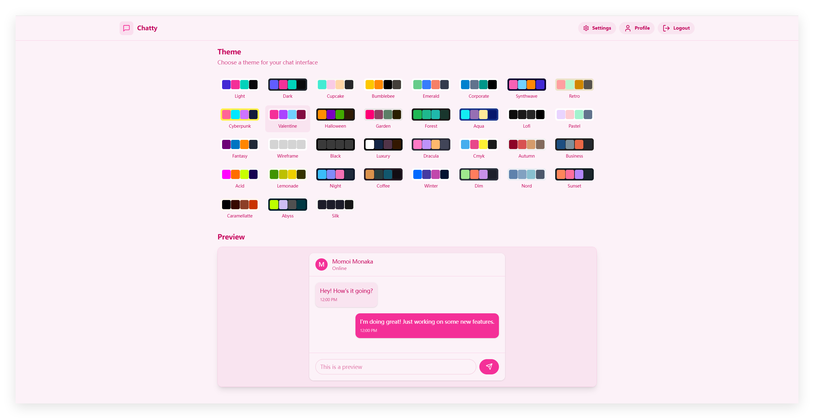
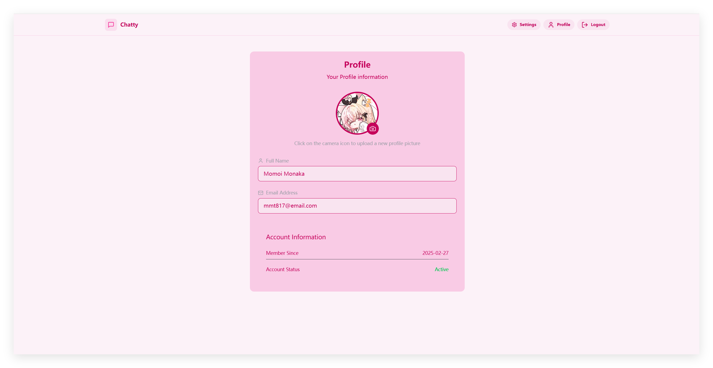
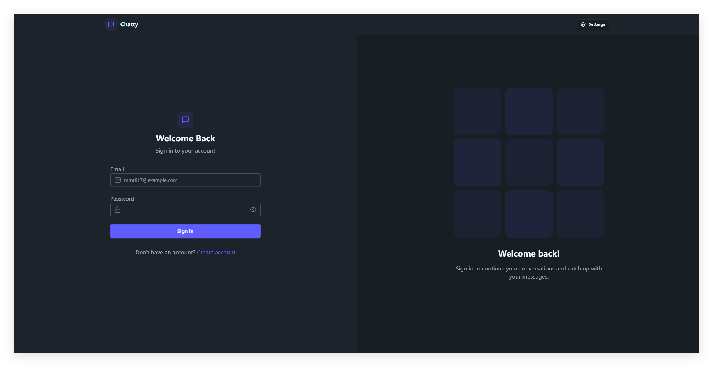
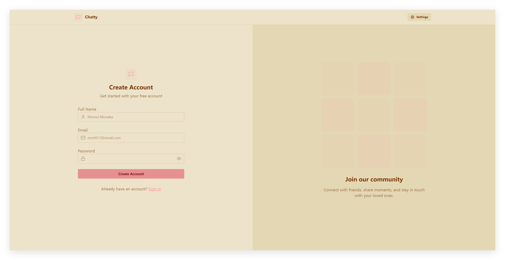
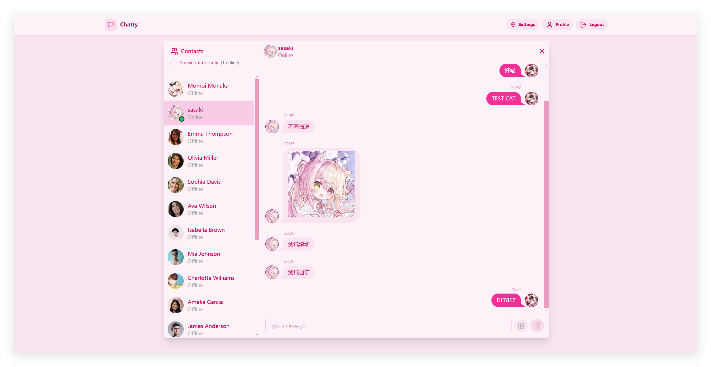
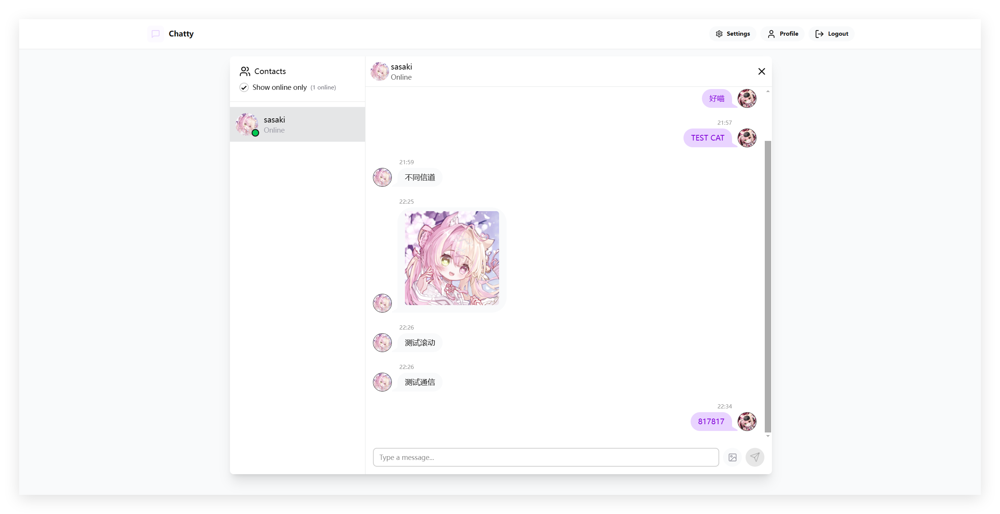
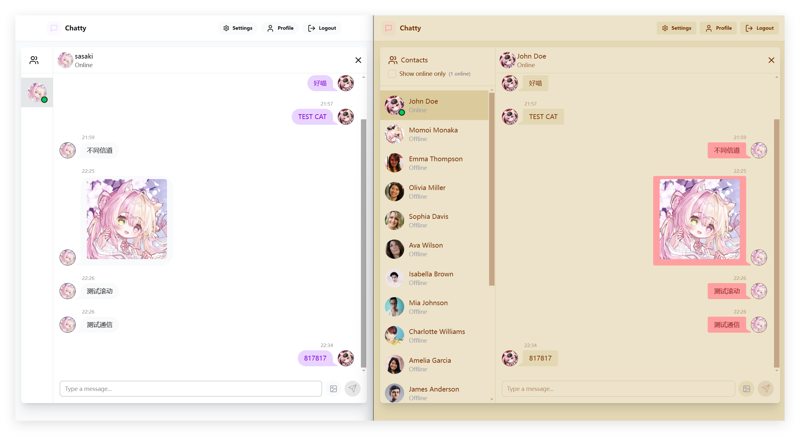

# ✨ 全栈实时聊天应用程序 ✨

## 介绍

* 🌟 技术栈: MERN + Socket.io + TailwindCSS + Daisy UI + Express + MongoDB + Cloudinary
* 🎃 Authentication && Authorization with JWT
* 🔥 提供多种主题切换
* 👾 基于 Socket.io 的实时聊天通信
* 🚀 用户在线状态处理
* 🐞 服务端/客户端双线处理错误

## 准备

> `backend` 文件夹下创建 `.env` 文件, 格式如下:
```js
MONGODB_URI=...
PORT=5001
JWT_SECRET=...

CLOUDINARY_CLOUD_NAME=...
CLOUDINARY_API_KEY=...
CLOUDINARY_API_SECRET=...

NODE_ENV=development
```

## 打包
> `pnpm build` 对 `frontend` 进行打包, 后端生产模式导入为静态资源

## 启动
> 生产模式: `pnpm start` 安装相关依赖并启动服务
> 开发模式: 前后端分别 `pnpm dev` 启动服务, 前端端口在 5173, 后端端口在 5001

## 展示








